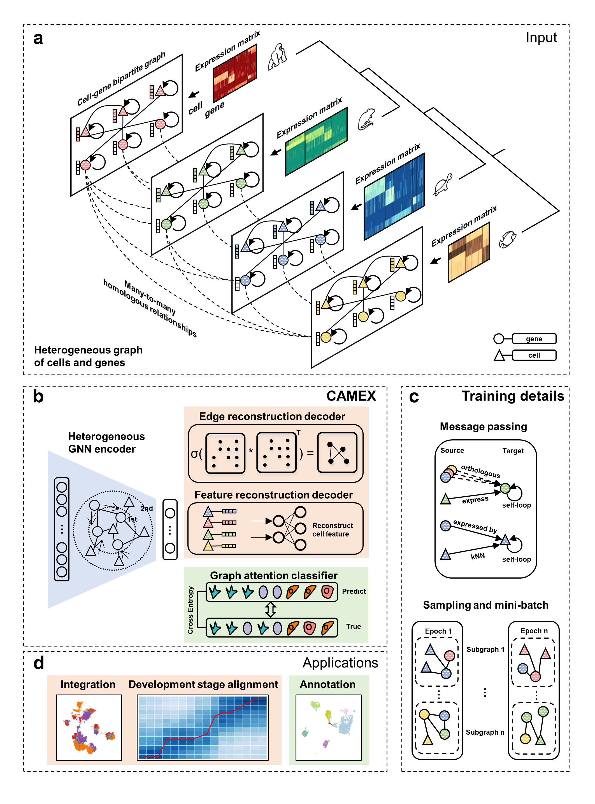

# CAMEX

## Overview
Single-cell RNA-seq (scRNA-seq) data from multiple species present remarkable opportunities 
to explore cellular origins and evolution. However, integrating and annotating scRNA-seq data 
across different species remains challenging due to the variations in sequencing techniques, 
ambiguity of homologous relationships, and limited biological knowledge. To tackle above 
challenges, we introduce CAMEX, a heterogeneous Graph Neural Network (GNN) tool which 
leverages many-to-many homologous relationships for integration, alignment and annotation 
of scRNA-seq data from multiple species. Notably, CAMEX outperforms state-of-the-art (SOTA) 
methods in terms of integration on various cross-species benchmarking datasets (ranging from 
one to eleven species). Besides, CAMEX facilitates the alignment of diverse species across 
different developmental stages, significantly enhancing our understanding of organ and 
organism origins. Furthermore, CAMEX makes it easier to detect species-specific cell types 
and marker genes through cell and gene embedding. In short, CAMEX holds the potential to 
provide invaluable insights into how evolutionary forces operate across different species 
at the single cell resolution. 



## Prerequisites

### Data

We collected several croo-species datasets which can be regarded as the benchmark to evaluate
CAMEX with other baseline methods, and can be downloaded from
[here](https://drive.google.com/drive/folders/1rwdjEvWFEFw82a0x2JzMi2jXICbUc5eb?usp=sharing).

### Environment

It is recommended to use a Python version  `3.9`.
* set up conda environment for STAMapper:
```
conda create -n CAMEX python==3.9
```
* install STAMapper from shell:
```
conda activate CAMEX
```

* the important Python packages used to run the model are as follows: 
```
pip install torch==1.13.1+cu116 torchvision==0.14.1+cu116 torchaudio==0.13.1 --extra-index-url https://download.pytorch.org/whl/cu116
pip install dgl-cu116 -f https://data.dgl.ai/wheels/repo.html
```
CAMEX is test on GPU, the versions of [torch](https://pytorch.org/) and [dgl](https://www.dgl.ai/pages/start.html)
need to be compatible with the version of CUDA.


## Installation
You can install CAMEX as follows:
```
git clone https://github.com/zhanglabtools/CAMEX.git
cd CAMEX
python setup.py bdist_wheel sdist
cd dist
pip install CAMEX-0.0.1.tar.gz
```

## Tutorials
The following are detailed tutorials. All tutorials were carried out on a notebook with a 11800H cpu and a 3070 8G gpu.

1. [CAMEX achieves competitive integration performance in a cross-species scenarios](./analysis/1liver/liver_analysis_UMAP_new.ipynb).

2. [CAMEX uncovers the conserved differentiation process in the testis across 11 species](./analysis/2testis/1testis_analysis_UMAP_new.ipynb).

3. [CAMEX aligns various development stages of seven organs across seven different species](./analysis/3bulk/3bulk_analysis_UMAP_new.ipynb).

4. [CAMEX could achieve more accurate integration and annotation performance in both relatives and distant species](./analysis/4cortex_annotation/4cortex_analysis_UMAP_new.ipynb).

5. [CAMEX facilitates the discovery of new populations and markers in Primate dlPFC](./analysis/5micro_mapping/5micro_analysis_UMAP_new.ipynb).
